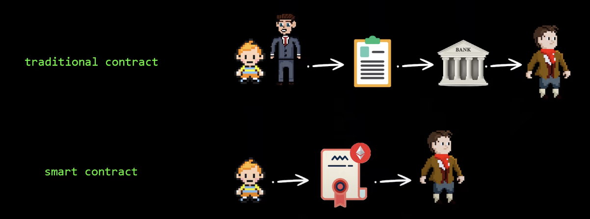
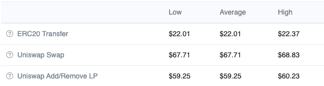
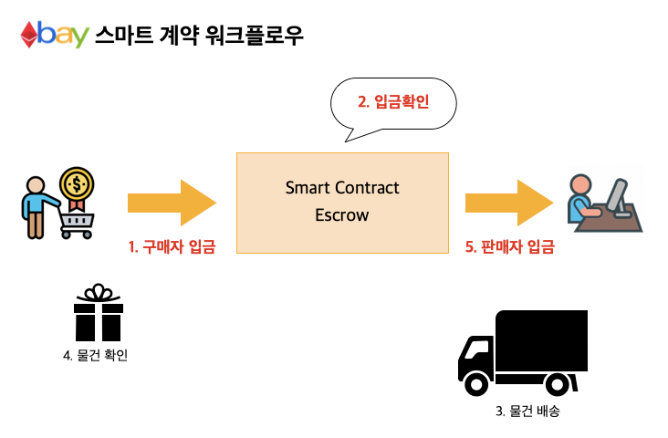

# 탈중앙화 eBay 만들기, 스마트 컨트랙트

이더리움 기반의 탈중앙화 eBay 개발

기존 이베이는 거래가 성사되면 ebay 회사가 판매자에게 알리고 거래내역을 직접 저장하는 방식이었지만, 이를 스마트 컨트랙트로 구현하여 탈중앙화된 eBay를 만들어보자.

[GitHub - boy672820/etherbay-contract: 탈중앙화 eBay 컨트랙트](https://github.com/boy672820/etherbay-contract)

# 탈중앙화(Decentralized)

---

탈중앙화란, 중앙집중화를 벗어나 분산된 소규모 단위로 자율적으로 운영되는 것을 말한다.


중앙화(Centralized), 탈중앙화(Decentraized), 분산화(Distributed)

[중앙화 vs 탈중앙화](https://www.notion.so/4cfb9550f5e24b2fa9394a3c0f6e8b85)

<aside>
💡 **분산화(Distributed networks)**란 개념도 있는데, 이는 명확히 **탈중앙화와 다른 의미**이다.
탈중앙화는 관리 주체가 특정하지 않지만, 분산화는 중앙화된 주체들이 분산되어 운영하는 것이다.

</aside>

## 탈중앙화를 하는 이유


- 자유롭고 평등한 참여자들에 의해 자율적으로 유지되고 운영
- 네트워크에 참여한 모든 사람들의 과반수 이상의 동의를 필요로 하는 탈중앙화 방식
- 중앙화된 기관이나 기업들은 담합하여 제3자를 억압할 수 있지만, 탈중앙화된 시스템의 사용자들은 다른 사용자들에게 피해를 끼쳐 이득을 취하기 어렵다.
- 중앙화된 시스템에 비해 해킹하는데 비용과 시간이 많이 든다.
- 많은 수의 데이터베이스가 독립되어 있어 장애가 발생할 확률이 낮다.

# 이더리움(Ethereum)

---

블록체인 기반에 스마트 계약을 구현하기 위한 플랫폼

<aside>
💡 **블록체인(Blockchain)**이란, 블록이라는 정보들에 집합을 체인처럼 연결하고 복사한 뒤 P2P 방식으로 여러 컴퓨팅 환경에 저장하는 분산 데이터 저장 기술이다.

</aside>

비트코인을 기반으로한 대표적인 알트코인(비트코인 이외의 대안적 암호화폐)으로 “비트코인 2.0”이라고 부른다.

## 스마트 계약(스마트 컨트랙트, Smart Contract)

기존 비트코인의 블록체인 기술을 그대로 계승할 뿐 아니라 금융거래, 부동산 계약, 공증 등 다양한 형태로 계약을 체결하고 이행하는 것을 스마트 계약이라고 한다. 이로 인해 블록체인은 과거의 정보를 보존하는 것에서 미래에 저장될 정보들도 관리할 수 있게 되었다.

프로그래밍으로 작성된 스마트 계약은 코드에 적힌 조건이 만족되면 그 즉시 계약이 성사된다. 어떠한 다운타임, 검열, 사기 행위, 제3자 간섭 없이 프로그래밍된 대로 정확히 실행된다.



기존 계약 체제의 경우 은행 등 제3자의 개입이 필요하지만, 블록체인 덕분에 어떠한 해킹의 위험도 없이 검증이 가능하다.

작성된 스마트 계약은 이더리움 네트워크에 저장된다. 어떠한 수정과 삭제도 할 수 없고, 스마트 계약에 작성된 코드 그대로 이행된다. 계약된 내역들 또한 수정&삭제가 불가능한체로 이더리움 블록체인에 트랜잭션이라는 형태로 저장된다.

<aside>
💡 이런 탈중앙화된 프로그램들을 **디앱 또는 댑(DApp, Decentralized Application)**이라고 한다.

</aside>

# 개발환경 소개

---

이더리움 네트워크에 개발된 스마트 컨트랙트를 배포하려면 수수료(가스비용, Gas Fee)를 지불해야 한다. 하지만 이더리움 수수료는 만만치 않기 때문에 배포와 테스트를 진행할 로컬 개발환경과 네트워크를 구성할 필요가 있다.



2022년 1월 21일 기준, 최대(127Gwei) 비용을 설정할 경우 22$를 지불해야 한다.

<aside>
💡 **가스 비용(Gas fee)**이란, 송금 또는 스마트 계약을 실행할 때 수수료를 책정하기 위해 만든 단위이다. 이더의 하위 단위인 Gwei로 계산된다. 가스 비용이 드는 이유는 이더리움 네트워크를 유지하기 위한 이유도 있지만, 고의적으로 이더리움 네트워크에 악영향을 미치는 행위를 막기 위해서이다.
일반 송금을 포함한 모든 트랜잭션은 21000가스가 소모되며, 트랜잭션 호출은 코드 크기에 따라 추가로 가스 비용을 요구한다.
가스 비용이 드는 이유는 데이터를 옮기고 블록을 증명하는 채굴자들의 연산 작업이 필요한데, 보상으로 이더리움 가스를 제공하기 때문이다.

</aside>

## Hardhat

스마트 계약을 컴파일, 배포 및 테스트를 위한 개발 환경으로 반복 작업 관리와 자동화에 최적화되어 있다.

개발용으로 설계된 로컬 이더리움 네트워크(Hardhat network)가 내장되어 있어 가스 비용 없이 스마트 계약을 배포하거나, JavaScript 기반 테스트 프레임워크인 mocha로 테스트를 자동화 할 수 있다.

## 솔리디티(Solidity)

솔리디티는 이더리움 등과 같은 블록체인 플랫폼 위에서 스마트 계약 구현을 위해 개발된 *계약 지향 프로그래밍 언어이다. EVM(이더리움 가상머신, Ethereum Virtual Machine)이라는 타깃으로 디자인된 솔리디티는 상속, 라이브러리, 타입 정의 등을 지원한다.

그 밖에 EVM을 타깃으로 설계된 Serpent, LLL, Viper 등의 언어가 있다.

<aside>
💡 솔리디티를 **계약 지향** 이라고 소개하고 있는데 자동화된 계약을 구현하기 위해 설계되었기 때문이다. 실상은 객체 지향 프로그래밍 언어이다.

</aside>

# 개발환경 설정하기

---

Node.js를 기반으로 하기 때문에 Node.js 설치는 필수이다.

Hardhat을 사용하여 개발환경을 설정하는 방법은 매우 쉽다. npx를 이용하여 명령어나 플랫폼 설치 없이 바로 환경설정이 가능하다.

`etherbay-contract` 라는 디렉토리를 만들고 hardhat 명령어를 실행힌다. `npx hardhat`

```bash
~ $ mkdir etherbay-contract && cd etherbay-contract
etherbay-contract $ npx hardhat
In file included from ../src/secp256k1/src/secp256k1.c:12:
../src/secp256k1/src/field_impl.h:266:13: warning: unused function 'secp256k1_fe_inv_all_var' [-Wunused-function]
static void secp256k1_fe_inv_all_var(secp256k1_fe *r, const secp256k1_fe *a, size_t len) {
            ^
In file included from ../src/secp256k1/src/secp256k1.c:14:
../src/secp256k1/src/group_impl.h:202:13: warning: unused function 'secp256k1_ge_set_infinity' [-Wunused-function]
static void secp256k1_ge_set_infinity(secp256k1_ge *r) {
            ^
../src/secp256k1/src/group_impl.h:691:12: warning: unused function 'secp256k1_gej_has_quad_y_var' [-Wunused-function]
static int secp256k1_gej_has_quad_y_var(const secp256k1_gej *a) {
           ^
../src/secp256k1/src/group_impl.h:272:12: warning: unused function 'secp256k1_gej_is_valid_var' [-Wunused-function]
static int secp256k1_gej_is_valid_var(const secp256k1_gej *a) {
           ^
In file included from ../src/secp256k1/src/secp256k1.c:15:
../src/secp256k1/src/ecmult_impl.h:1168:12: warning: unused function 'secp256k1_ecmult_multi_var' [-Wunused-function]
static int secp256k1_ecmult_multi_var(const secp256k1_callback* error_callback, const secp256k1_ecmult_context *ctx, secp256k1_scratch *scratch, secp256k1_gej *r, const secp256k1_scalar *inp_g_sc, secp256k1_ecmult_multi_callback cb, void *cbdata, size_t n) {
           ^
../src/secp256k1/src/ecmult_impl.h:695:12: warning: unused function 'secp256k1_ecmult_strauss_batch_single' [-Wunused-function]
static int secp256k1_ecmult_strauss_batch_single(const secp256k1_callback* error_callback, const secp256k1_ecmult_context *actx, secp256k1_scratch *scratch, secp256k1_gej *r, const secp256k1_scalar *inp_g_sc, secp256k1_ecmult_multi_callback cb, void *cbdata, size_t n) {
           ^
../src/secp256k1/src/ecmult_impl.h:982:15: warning: unused function 'secp256k1_pippenger_scratch_size' [-Wunused-function]
static size_t secp256k1_pippenger_scratch_size(size_t n_points, int bucket_window) {
              ^
../src/secp256k1/src/ecmult_impl.h:1075:12: warning: unused function 'secp256k1_ecmult_pippenger_batch_single' [-Wunused-function]
static int secp256k1_ecmult_pippenger_batch_single(const secp256k1_callback* error_callback, const secp256k1_ecmult_context *actx, secp256k1_scratch *scratch, secp256k1_gej *r, const secp256k1_scalar *inp_g_sc, secp256k1_ecmult_multi_callback cb, void *cbdata, size_t n) {
           ^
8 warnings generated.
888    888                      888 888               888
888    888                      888 888               888
888    888                      888 888               888
8888888888  8888b.  888d888 .d88888 88888b.   8888b.  888888
888    888     "88b 888P"  d88" 888 888 "88b     "88b 888
888    888 .d888888 888    888  888 888  888 .d888888 888
888    888 888  888 888    Y88b 888 888  888 888  888 Y88b.
888    888 "Y888888 888     "Y88888 888  888 "Y888888  "Y888

👷 Welcome to Hardhat v2.8.3 👷‍

? What do you want to do? … 
❯ Create a basic sample project
  Create an advanced sample project
  Create an advanced sample project that uses TypeScript
  Create an empty hardhat.config.js
  Quit
```

설치 준비가 완료되면 프로젝트의 형태를 선택할 수 있다. 기본설정과 고급설정, 타입스크립트 지원 등 아무거나 선택해도 되지만 `Create an empty hardhat.config.js` 는 설정파일만 있는 빈 프로젝트를 생성하기 때문에 가능하면 선택하지 않는 걸 추천한다.(고급 사용자용)

```bash
👷 Welcome to Hardhat v2.8.3 👷‍

✔ What do you want to do? · Create a basic sample project
✔ Hardhat project root: · /Users/seondev/Projects/etherbay-contract
✔ Do you want to add a .gitignore? (Y/n) · y
✔ Do you want to install this sample project's dependencies with npm (hardhat @nomiclabs/hardhat-waffle ethereum-waffle chai @nomiclabs/hardhat-ethers ethers)? (Y/n) · y

npm install --save-dev hardhat@^2.8.3 @nomiclabs/hardhat-waffle@^2.0.0 ethereum-waffle@^3.0.0 chai@^4.2.0 @nomiclabs/hardhat-ethers@^2.0.0 ethers@^5.0.0
...
etherbay-contract $ ls -al
total 32
drwxr-xr-x   9 seondev  staff  288  1 22 12:37 .
drwx------  22 seondev  staff  704  1 22 12:31 ..
-rw-r--r--   1 seondev  staff   83  1 22 12:37 .gitignore
-rw-r--r--   1 seondev  staff  467  1 22 12:37 README.md
drwxr-xr-x   3 seondev  staff   96  1 22 12:37 contracts
-rw-r--r--   1 seondev  staff  572  1 22 12:37 hardhat.config.js
-rw-r--r--   1 seondev  staff   32  1 22 12:34 package.json
drwxr-xr-x   3 seondev  staff   96  1 22 12:37 scripts
drwxr-xr-x   3 seondev  staff   96  1 22 12:37 test
```

[Hardhat 프로젝트 구조](https://www.notion.so/10c1e927e02d4300a9edb40127e3e1be)

### 스마트 컨트랙트 컴파일링

기본 설정으로 설치할 경우 `Greeter.sol` 파일이 생성되어 있다.

```solidity
//SPDX-License-Identifier: Unlicense
pragma solidity ^0.8.0;

import "hardhat/console.sol";

contract Greeter {
    string private greeting;

    constructor(string memory _greeting) {
        console.log("Deploying a Greeter with greeting:", _greeting);
        greeting = _greeting;
    }

    function greet() public view returns (string memory) {
        return greeting;
    }

    function setGreeting(string memory _greeting) public {
        console.log("Changing greeting from '%s' to '%s'", greeting, _greeting);
        greeting = _greeting;
    }
}
```

다음 명령어를 사용하여 컴파일 할 수 있다.

```bash
$ npx hardhat compile
```

### 스마트 컨트랙트 테스팅

이더리움은 스마트 컨트랙트에 작성된 코드의 효율성에 따라 가스 비용이 많이 발생하거나 낮게 발생할 수 있다. 때문에 스마트 컨트랙트를 개발할 때는 테스트 위주 프로그래밍을 하는데, hardhat에서 제공하는 mocha와 chai를 이용해보자

`test/` 디렉토리에 `sample-test.js` 파일을 보면 아래와 같다.

```jsx
const { expect } = require("chai");
const { ethers } = require("hardhat");

describe("Greeter", function () {
  it("Should return the new greeting once it's changed", async function () {
    const Greeter = await ethers.getContractFactory("Greeter");
    const greeter = await Greeter.deploy("Hello, world!");
    await greeter.deployed();

    expect(await greeter.greet()).to.equal("Hello, world!");

    const setGreetingTx = await greeter.setGreeting("Hola, mundo!");

    // wait until the transaction is mined
    await setGreetingTx.wait();

    expect(await greeter.greet()).to.equal("Hola, mundo!");
  });
});
```

아래 명령어로 테스트 스크립트를 실행할 수 있다. `npx hardhat test`

```bash
etherbay-contract $ npx hardhat test

Greeter
Deploying a Greeter with greeting: Hello, world!
Changing greeting from 'Hello, world!' to 'Hola, mundo!'
    ✓ Should return the new greeting once it's changed (350ms)

  1 passing (353ms)

etherbay-contract $
```

### 스마트 컨트랙트 배포

`scripts/` 디렉토리를 보면 `sample-script.js` 파일이 있다. hardhat에서 제공하는 기능을 사용하거나 배포를 위한 스크립트가 사용되어 있다.

```jsx
// We require the Hardhat Runtime Environment explicitly here. This is optional
// but useful for running the script in a standalone fashion through `node <script>`.
//
// When running the script with `npx hardhat run <script>` you'll find the Hardhat
// Runtime Environment's members available in the global scope.
const hre = require("hardhat");

async function main() {
  // Hardhat always runs the compile task when running scripts with its command
  // line interface.
  //
  // If this script is run directly using `node` you may want to call compile
  // manually to make sure everything is compiled
  // await hre.run('compile');

  // We get the contract to deploy
  const Greeter = await hre.ethers.getContractFactory("Greeter");
  const greeter = await Greeter.deploy("Hello, Hardhat!");

  await greeter.deployed();

  console.log("Greeter deployed to:", greeter.address);
}

// We recommend this pattern to be able to use async/await everywhere
// and properly handle errors.
main()
  .then(() => process.exit(0))
  .catch((error) => {
    console.error(error);
    process.exit(1);
  });
```

작성된 컨트랙트를 배포하기 위해 다음 명령어를 실행한다. `npx hardhat run scripts/sample-script.js`

```bash
etherbay-contract $ npx hardhat run scripts/sample-script.js
Deploying a Greeter with greeting: Hello, Hardhat!
Greeter deployed to: 0x5FbDB2315678afecb367f032d93F642f64180aa3
```

### hardhat 독립 네트워크에 연결하기

hardhat에서 제공하는 네트워크는 EVM을 모방하여 로컬 환경에서 독립적으로 실행한다. 이런 독립 네트워크는 메모리에 상주하여 인스턴스화 되어있다. 실행된 hardhat 네트워크는 HTTP 또는 JSON-RPC를 통해 클라이언트와 요청을 주고 받을 수 있다.

`npx hardhat node` 명령어를 실행하여 네트워크를 실행할 수 있다.

```bash
etherbay-contract $ npx hardhat node
Started HTTP and WebSocket JSON-RPC server at http://127.0.0.1:8545/

Accounts
========

WARNING: These accounts, and their private keys, are publicly known.
Any funds sent to them on Mainnet or any other live network WILL BE LOST.

Account #0: 0xf39fd6e51aad88f6f4ce6ab8827279cfffb92266 (10000 ETH)
Private Key: 0xac0974bec39a17e36ba4a6b4d238ff944bacb478cbed5efcae784d7bf4f2ff80

Account #1: 0x70997970c51812dc3a010c7d01b50e0d17dc79c8 (10000 ETH)
Private Key: 0x59c6995e998f97a5a0044966f0945389dc9e86dae88c7a8412f4603b6b78690d

Account #2: 0x3c44cdddb6a900fa2b585dd299e03d12fa4293bc (10000 ETH)
Private Key: 0x5de4111afa1a4b94908f83103eb1f1706367c2e68ca870fc3fb9a804cdab365a

...

WARNING: These accounts, and their private keys, are publicly known.
Any funds sent to them on Mainnet or any other live network WILL BE LOST.
```

실행된 독립 네트워크에 내가 작성한 스마트 컨트랙트를 배포하려면 `--network localhost` 옵션을 추가하면 된다.

```bash
etherbay-contract $ npx hardhat run scripts/sample-script.js --network localhost
```

# etherBay 스마트 컨트랙트 구성하기

---

이베이는 오픈마켓 서비스로 누구나 상품을 판매하고 구매할 수 있다. 때문에 판매자는 상품을 누구나 무료로 올릴 수 있는 기능을 만들고, 구매자는 상품을 구매하는 기능을 컨트랙트로 구현한다.

이베이의 장점 중 하나는 사기 방지 기능인데, 구매자 입금 후 판매자가 물건을 보내지 않을 경우를 대비해 구매자가 에스크로에 입금하게 한 후 판매자가 물건을 보내면 최종적으로 판매자에게 입금하게 되어있다. 이 에스크로의  기능을 스마트 컨트랙트가 대체할 수 있다.



서드파티 서비스를 이용하여 스마트 컨트랙트가 구매 금액을 확인하게 만들 수 있지만, 탈중앙화를 위해 거래 대금은 이더(ETH)로 대체한다.

<aside>
💡 이더(ETH)란, 이더리움 네트워크의 기본 통화로 비트코인과 같은 “디지털 화폐”이다. 이더리움 기반의 디앱들은 이더를 사용할 수 있으며 트랜잭션 처리 및 거래 등에 사용되고 있다. 이더리움의 채굴자들은 채굴의 보상으로 이더를 지급받는다.

</aside>

etherBay 스마트 컨트랙트가 하는 일을 정리하자면 다음과 같다.

- 판매 물건에 대한 정보를 이더리움 상에 저장하기 → 트랜잭션 저장
- 판매 물건 구매하기 → 이더 입금
- 구매자 물건 확인 완료 → 판매자에게 이더 전송

## ProductFactory 컨트랙트

`contract` 는 솔리디티의 기본적인 구성으로 스마트 계약 자체를 의미한다. 모든 솔리디티 코드는 `contract` 안에 작성한다.

우리가 만들 첫번째 기능은 **판매자가 올린 물건을 이더리움 네트워크에 저장**하는 기능을 만들어 볼 것이다. 이 기능을 담당하는 컨트랙트 이름은 `ProductFactory` 라고 하겠다.

```solidity
//SPDX-License-Identifier: MIT
pragma solidity ^0.8.0;

contract ProductFactory {
}
```

### Version Pragma

솔리디티 코드를 작성할 때는 제일 먼저 `pragama solidity ^0.8.0` 와 같이 솔리디티 버전을 선언해야 한다. 이를 통해 새로운 버전이 나와도 기존 코드와 호환하도록 예방할 수 있다.

솔리디티는 개발된지 얼마되지 않은 언어이기 때문에 아직 안정화가 되지 않은 상태이다. 새로운 버전이 나올때마다 기존 문법이 바뀌거나 새로운 문법이 나오기 때문에 버전 설정은 중요하다.

### 상태 변수로 상품 정보 저장

상태 변수는 컨트랙트 저장소에 영구적으로 저장된다. 즉, 이더리움 네트워크에 기록되는 것이다.(데이터베이스에 데이터를 저장하는 것과 동일하다.)

판매 상품을 올리기위해 저장될 정보는 아래와 같다. 이 정보들을 상태 변수로 만들어 이더리움 네트워크에 있는 우리 컨트랙트 저장소에 저장할 것이다.

- 상품명
- 카테고리
- 상품 정보
- 상품 이미지

```solidity
//SPDX-License-Identifier: MIT
pragma solidity ^0.8.0;

contract ProductFactory {
  string name;
  string category;
  string description;
  string image;
}
```

이러한 상품의 정보들을 구조체(struct)로 만들어 저장하면 복잡한 자료형을 정리하는데 도움이 된다.

```solidity
//SPDX-License-Identifier: MIT
pragma solidity ^0.8.0;

contract ProductFactory {
  struct Product {
    string name;
    string category;
    string description;
    string image;
  }
}
```

### 배열, 상품 생성하기

솔리디티에서 배열은 정적 할당과 동적 할당을 지원한다.

```solidity
// 2개의 원소를 담을 수 있는 고정 길이의 배열
uint[2] fixedArray;
// 동적 배열은 고정된 크기가 없으며 계속 크기가 커질 수 있다
uint[] dynamicArray;
```

`Product` 구조체를 동적 배열로 추가하여 구조화된 데이터를 저장시킬 수 있다.(데이터베이스를 프로그래밍 방식으로 생성한다고 생각하면 이해하는데 도움이 될 것 이다.)

```solidity
// 데이터베이스처럼 구조화된 데이터를 저장 시킬 수 있어 유용하다.
Product[] products;
```

### 가시성(visiability), 상품 외부 공개하기

가시성은 외부 즉, 다른 컨트랙트나 사용자들에게 해당 데이터를 공개할지 결정하는 여부이다. `external` `public` `private` `ineternal` 총 4가지가 있다.

- **external**: 컨트랙트 외부에서만 호출이 가능하다.(내부에서는 호출이 불가능)
- **public**: 내부와 외부 모두 호출이 가능하다.
- **private**: 내부에서만 호출이 가능하다.
- **internal**: 내부 또는 **상속**된 컨트랙트에서 호출이 가능하다.

판매 상품은 구매자들에게 보여줄 수 있도록 public으로 선언한다.

```solidity
//SPDX-License-Identifier: MIT
pragma solidity ^0.8.0;

contract ProductFactory {
  struct Product {
    string name;
    string category;
    string description;
    string image;
  }

	// 상품 배열을 공개 상태변수로 선언
	Product[] public products;
}
```

<aside>
💡 `external` 로 선언하지 않은 이유는 다음에서 다루어볼 상품 추가를 위해 `public`으로 선언하였다.

</aside>

### 함수 선언, 상품 생성하기

함수를 만들어 상품을 추가하도록 만들 수 있다. 상품을 생성하는 주체는 판매자들이므로 외부에서 컨트랙트를 호출할 필요가 있다. 공개 함수로 선언하도록 하자

```solidity
// 상품을 생성하는 함수, 외부에서만 사용하기 때문에 external로 지정한다.
// 솔리디티에서는 함수에 가시성과 같은 것들을 함수명 다음에 지정한다. 이런 것들을 함수에 속성이라고 한다.
function createProduct() external {}
```

상품의 정보를 위해 인자를 전달 받아야한다.

```solidity
// "_"는 전역 변수와 구별을 위한 관례이다.(필수는 아님)
function createProduct(
	string calldata _name,
	string calldata _category,
	string calldata _description,
	string calldata _image
) external {}
```

`calldata` 는 데이터 저장 위치를 말한다. 솔리디티에서는 해당 변수의 출처가 어디인지 필수적으로 명시해 주어야한다.(솔리디티 버전 0.5.0에 추가됨) 데이터 저장 위치는 배열(array), 구조체(struct), 매핑(mapping, 이 과정에서 다룰 예정), 문자열(string)만 지정한다.

저장 위치는 `calldata` `memory` `storage` 3가지가 있다.

- **calldata**: 함수의 매개변수(인자)가 저장되는 위치
- **memory**: 메모리에 저장되는 변수, 상태 변수를 제외한 모든 변수들은 memory에 상주한다.
- **storage**: 상태 변수가 저장되는 위치

참고로 `calldata` 는 수정 불가능하며 메모리처럼 동작한다.

이제 전달 받은 인자로 `Product` 상태 변수에 상품을 추가해보자

```solidity
function createProduct(
	string calldata _name,
	string calldata _category,
	string calldata _description,
	string calldata _image
) external {
	// 상품 구조체 생성
	Product memory newProduct = Product(_name, _category, _description, _image);
	// 상태 변수에 추가한다.
	// push는 배열에 값을 넣을 때 사용된다.
	products.push(newProduct);
}
```

### 이벤트, 사용자에게 알리기

이벤트는 컨트랙트가 블록체인에서 무언가 발생했을 때 의사소통하는 방법이다. 사용자는 컨트랙트에서 특정 이벤트가 발생하는지 감지하여 행동을 취한다.

```solidity
// 이벤트를 선언한다.
event IntegersAdded(uint x, uint y, uint result);

function add(uint calldata _x, uint calldata _y) external returns(uint memory) {
  uint memory result = _x + _y;
  // 이벤트를 실행하여 add 함수가 실행되었음을 알린다.
  emit IntegersAdded(_x, _y, result);

  return result;
}
```

상품이 생성되면 사용자에게 알리기위해 이벤트를 추가한다.

그리고 사용자들이 추가된 상품을 찾기위해 배열의 색인을 추가한다.

```solidity
// 이벤트를 선언한다.
event NewProduct(
    uint256 id,
    string name,
    string category,
    string description,
    string image
  );

function createProduct(
    string calldata _name,
    string calldata _category,
    string calldata _description,
    string calldata _image
  ) external {
    Product memory newProduct = Product(_name, _category, _description, _image);
    products.push(newProduct);

		// 추가된 상품의 색인, (uint256) 정수 타입은 저장 위치를 지정해 줄 필요가 없다.
    uint256 id = products.length - 1;
		// 상품이 추가된 후 이벤트가 발생한다.
    emit NewProduct(id, _name, _category, _description, _image);
  }
```

최종 코드는 다음과 같다.

```solidity
//SPDX-License-Identifier: MIT
pragma solidity ^0.8.0;

contract ProductFactory {
  event NewProduct(
    uint256 id,
    string name,
    string category,
    string description,
    string image
  );

  struct Product {
    string name;
    string category;
    string description;
    string image;
  }

  Product[] public products;

  function createProduct(
    string calldata _name,
    string calldata _category,
    string calldata _description,
    string calldata _image
  ) external {
    Product memory newProduct = Product(_name, _category, _description, _image);
    products.push(newProduct);

    uint256 id = products.length - 1;

    emit NewProduct(id, _name, _category, _description, _image);
  }
}
```

### 테스팅, 상품 추가 & 상품 확인하기

상품 추가를 위한 기본적인 솔리디티 코드를 작성해보았다. Hardhat에서 지원하는 테스팅 툴을 이용하여 테스트를 진행해보자.

아래는 테스팅을 위한 스크립트 코드이다.

```solidity
const { expect } = require('chai');
const { ethers } = require('hardhat');

describe('ProductFactory', async function () {
  let productFactory;
  let newProductEvents = [];

  const product = [
    'MacBook-pro M1X 16inch',
    'apple',
    'MacBook-pro M1X 16inch, Space Gray, 64GB Memory, 8TB SSD Storage, Pre-Installed "Final Cut Pro" and "Logic Pro"',
    'https://store.storeimages.cdn-apple.com/8756/as-images.apple.com/is/mbp16-spacegray-gallery2-202110?wid=4000&hei=3072&fmt=jpeg&qlt=80&.v=1632799174000',
  ];

  before(async function () {
    const Factory = await ethers.getContractFactory('ProductFactory');
    const factory = await Factory.deploy();
    await factory.deployed();

    productFactory = factory;
  });

  it('#1 상품 생성하기', async function () {
    const createProduct = await productFactory.createProduct(...product);

    const receipt = await createProduct.wait();

    const events = receipt.events.filter((x) => {
      return x.event == 'NewProduct';
    });
    newProductEvents = events;

    expect(events).to.not.length(0);
  });

  it('#2 추가된 상품 조회하기', async function () {
    const lastEvent = newProductEvents.pop();
    const productId = lastEvent.args.id.toNumber();

    const { name, category, description, image, ...hot } = await productFactory.products(productId);
    const newProduct = Object.values(hot);

    expect(newProduct).deep.to.equal(product);
  });
});
```

해당 스크립트는 상품 생성 후 생성된 상품이 정상적으로 생성되었는지 확인하는 테스트이다. 문제가 있는 경우 에러 메시지를 확인하여 컨트랙트를 수정하자.

etherBay 컨트랙트 소스코드는 [github](https://github.com/boy672820/etherbay-contract)에서 확인할 수 있다.

# 표준화, 토큰 컨트랙트와 상호작용하기

---

이더리움에는 ERC20, ERC721과 같은 토큰이라는 개념이 있다. 쉽게 말해 스마트 계약으로 구현된 디지털 화폐로 이더리움 네트워크에서 정한 표준 스펙이 존재한다. 예를 들어 `transfer` `balanceOf` `ownerOf` 와 같은 함수들이 있다.

<aside>
💡 **ERC20(Ethereum Request for Comment 20) 이란**, 이더리움 커뮤니티의 Ethereum Request for Comment라는 게시판의 20번째 글을 줄여서 표현한 것이다.
이더리움의 창시자 비탈릭 부테린(Vitalik Buterin)이 제안한 표준 토큰 스펙으로 디앱에서 사용되는 ETH를 제외한 디지털 자산이다. 현금과 같이 1:1의 교환이 가능한 가치를 지니고 있다.(1$와 1$는 같은 가치를 지니고 있기 때문에 의미는 없지만 교환이 가능하다.)

</aside>

## ERC721 표준, 내 상품 확인하기

`ProductFactory` 컨트랙트는 이더리움 표준 토큰 중 ERC721과 상당히 유사하다. ERC721 이란, 증서라고 알려진 대체불가토큰(NFT, Non Fungible Token) 표준안으로 발행된 토큰들은 서로 대체가 불가능하기 떄문에 각각의 가치를 지닌다. 우리가 올릴 상품들 또한 각각의 가치가 다르기 때문에 ERC721 표준에 맞춰 각각의 기능들을 구현해 보겠다.

우선 우리의 `ProductFactory` 컨트랙트는 아직 상품의 주인이 누구인지 모른다. 때문에 상품의 주인을 확인할 수 있게 ERC721의 표준 함수인 `balanceOf` `ownerOf` 함수를 만들어보겠다.

- **balanceOf**: 소유자의 자산(토큰)의 보유 갯수를 반환
- **ownerOf**: 지정한 토큰의 소유자를 반환

```solidity
// 외부 호출 함수이기 때문에 external로 설정, 스토리지 변경이 없기 때문에 view 함수이다
function balanceOf(address _owner) external view returns (uint256) {
	// 소유한 자산의 갯수를 반환한다
}
function ownerOf(uint256 _id) external view returns (address) {
		// 토큰의 소유자 주소를 반환한다
}
```

<aside>
💡 [Openzeppelin에서 제공하는 ERC721 표준 스펙](https://docs.openzeppelin.com/contracts/2.x/api/token/erc721#IERC721)이다. Openzeppelin은 ERC20, ERC777과 같은 토큰 스펙을 구현한 컨트랙트들을 오픈소스로 제공하고 있다. 많은 사람들이 사용중이고 검증된 오픈소스이기 때문에 표준 스펙을 구현하는데 많이 사용된다.

</aside>

### 매핑과 주소, 소유자 주소 저장하기

함수를 만들기 전에 상품 소유자와 소유한 상품의 갯수를 스토리지에 저장할 필요가 있다. 때문에 다음과 같이 구현해볼 예정이다.

- 소유자 = 소유한 상품 갯수
- 상품 = 소유자

이러한 그룹을 묶어 구조화된 형태로 저장하는 방식을 솔리디티에서 **매핑(mapping)** 이라고 한다. 매핑은 기본적으로 키와 값(key=value) 형태로 데이터를 저장하고 검색에는 key 값이 사용된다. 이때 소유자의 고유한 값이 **주소(address)**를 이용해보록 하겠다. 주소 또한 솔리디티의 타입 중 하나로 이더리움의 주소를 나타내는 타입이다.

`ProductFactory` 컨트랙트에 다음 매핑을 추가한다.

```solidity
// 소유자 주소 => 소유한 상품 갯수, 소유자 주소를 조회하여 갯수를 반환한다.
mapping(address => uint256) public ownerProductCount;
// 상품 => 소유자 주소, 상품ID 값으로 조회하여 소유자 주소를 반환한다.
mapping(uint256 => address) public productToOwner;
```

### 상속, 소유(Ownership) 컨트랙트 생성하여 로직 분리하기

상속을 이용하여 로직을 분리할 수 있다. ERC721 표준 스펙으로 토큰을 전송(소유권 이전)하는 함수들이 있다. 이런 함수들을 `ProductFactory` 컨트랙트에 모두 작성하면 코드가 길어져 개발하는데 가독성이 좋지 않다.

`ProductOwnership` 컨트랙트 파일을 생성한 후 `ProductFactory` 컨트랙트 파일을 import 구문으로 가져온다.

```solidity
//SPDX-License-Identifier: MIT
pragma solidity ^0.8.0;

// ProductFactory의 모든 컨트랙트를 가져온다.
import './ProductFactory.sol';

contract ProductOwnership {
}
```

import 구문으로 해당 솔리디티 파일에 모든 컨트랙트를 가져올 수 있다.

이후 `ProductOwnership` 컨트랙트에 is 문법으로 `ProductFactory` 컨트랙트를 상속할 수 있다. 상속받은 컨트랙트는 상속 컨트랙트에 상태 변수와 메서드를 사용(internal과 public으로 선언된)할 수 있다.

balanceOf와 ownerOf를 추가한 후 상속받은 `ProductFactory` 컨트랙트의 상태 변수인 ownerProductCount와 ProductToOwner를 추가한다.(각각의 함수를 구현하는데 사용)

```solidity
//SPDX-License-Identifier: MIT
pragma solidity ^0.8.0;

import './ProductFactory.sol';

contract ProductOwnership is ProductFactory {
	// ProductFactory를 상속받아 internal or public으로 선언된 모든 상태변수와 메서드를 사용

	/**
   * @dev 토큰 소유량 가져오기
   */
  function balanceOf(address _owner) public view virtual returns (uint256) {
		// ownerProductCount 상태변수는 해당 주소가 소유한 토큰의 총 수량을 나타냄
    return ownerProductCount[_owner];
  }

  /**
   * @dev 토큰 소유자 가져오기
   */
  function ownerOf(uint256 _tokenId) public view returns (address) {
		// productToOwner 상태변수는 해당 토큰의 소유자 주소를 나타냄
    return productToOwner[_tokenId];
  }
}
```

### Transfer, 소유자 이전하기

ERC721 스펙으로 한 계정에 토큰을 다른 계정으로 소유자 이전하는 transferFrom 메서드를 구현해보자. 실질적으로 계정에 토큰이 존재하는 것이 아닌 컨트랙트 로직에서 특정 토큰이 계정주소를 가리키고 있는 것이다.(블록체인 상에서 트랜잭션이라는 형태로 저장되어 있음) 때문에 transferFrom 메서드를 구현하는 것은 쉽다.

```solidity
function transferFrom(
    address _from,
    address _to,
    uint256 _tokenId
  ) private {
    ownerProductCount[_from]--;
    ownerProductCount[_to]++;

    productToOwner[_tokenId] = _to;

    emit Transfer(_from, _to, _tokenId);
  }
```

하지만 이런식으로 구현한다면 누구나 메서드를 호출할 수 있고 보안에 매우 취약하다. 때문에 ERC721에서는 해당 메서드를 호출하기 전 소유자 승인 로직이 필요하다고 한다. 이 소유자 승인을 처리하는 메서드를 approve라고 한다.

approve 메서드는 오직 토큰 소유자만 호출할 수 있다. 때문에 거래는 소유자 승인 후 구매자 또는 소유자가 transferFrom 호출을 통해 거래가 성사된다.

require는 조건이 참 혹은 거짓인지 확인하고 참일 경우만 코드 흐름을 허용한다. 거짓일 경우 나머지 코드는 실행되지 않고 트랜잭션은 취소(revert)된다. 때문에 매개변수로 받은 값을 확인하기 위해 많이 사용된다.

```solidity
// 토큰 소유자가 승인한 계정들이 저장된다.
mapping(uint256 => address) private _approvals;

function approve(address _to, uint256 _tokenId) public {
  address owner = this.ownerOf(_tokenId);

	// 승인할 계정이 소유자일 경우 취소
	// 거짓일 경우 두번째 매개변수로 받은 에러 메세지를 EVM에 반환한다.
  require(_to != owner, 'Approval to current owner');
	// 호출자가 해당 토큰 소유자 맞는지 확인
  require(
    msg.sender == owner,
    'Approve caller is not owner nor approved for all'
  );

	// 상태변수에 저장
  _approve(_to, _tokenId);
}

/**
 * @dev 토큰 승인
 */
function _approve(address _to, uint256 _tokenId) private {
  _approvals[_tokenId] = _to;

  emit Approval(this.ownerOf(_tokenId), _to, _tokenId);
}
```

마지막으로 transferFrom 메서드에 해당 토큰이 소유자 승인을 받은 토큰인지 확인하는 로직만 추가해주면 된다. (transferFrom은 승인 받지 않은 토큰이여도 소유자는 호출이 가능하다.)

```solidity
function transferFrom(
  address _from,
  address _to,
  uint256 _tokenId
) external {
  require(
		// 승인 받은 구매자 또는 소유자 인지 확인
		// 소유자는 해당 메서드를 호출할 수 있다.
    _isApprovedOrOwner(msg.sender, _tokenId),
    'Transfer caller is not owner nor approved'
  );

  _transfer(_from, _to, _tokenId);
}

/**
 * @dev 토큰 소유자 또는 결제자 승인 여부 반환
 */
function _isApprovedOrOwner(address _spender, uint256 _tokenId)
  internal
  view
  returns (bool)
{
  address owner = this.ownerOf(_tokenId);

  return (_spender == owner || getApproved(_tokenId) == _spender);
}

/**
 * @dev 승인 여부 가져오기
 */
function getApproved(uint256 _tokenId) public view returns (address) {
  require(_exists(_tokenId), 'Operator query for nonexistent token');

  return _approvals[_tokenId];
}
/**
 * @dev 토큰ID의 소유자 여부 반환
 */
function _exists(uint256 _tokenId) internal view returns (bool) {
  return productToOwner[_tokenId] != address(0);
}
```

### 최종코드

- 토큰 전송과 승인에 따른 이벤트 추가
- 코드 재사용을 위해 로직 분리
- 데이터 저장 로직 분리

```solidity
//SPDX-License-Identifier: MIT
pragma solidity ^0.8.0;

import './ProductFactory.sol';

contract ProductOwnership is ProductFactory {
  event Transfer(address from, address to, uint256 tokenId);
  event Approval(address productToOwner, address to, uint256 tokenId);

  mapping(uint256 => address) private _approvals;

  /**
   * @dev 토큰 소유량 가져오기
   */
  function balanceOf(address _owner) public view virtual returns (uint256) {
    return ownerProductCount[_owner];
  }

  /**
   * @dev 토큰 소유자 가져오기
   */
  function ownerOf(uint256 _tokenId) public view returns (address) {
    return productToOwner[_tokenId];
  }

  /**
   * @dev 소유자 또는 승인 여부에 따른 토큰 전송
   */
  function transferFrom(
    address _from,
    address _to,
    uint256 _tokenId
  ) external {
    require(
      _isApprovedOrOwner(msg.sender, _tokenId),
      'Transfer caller is not owner nor approved'
    );

    _transfer(_from, _to, _tokenId);
  }

  /**
   * @dev 소유자가 토큰 승인하기
   */
  function approve(address _to, uint256 _tokenId) public {
    address owner = this.ownerOf(_tokenId);

    require(_to != owner, 'Approval to current owner');
    require(
      msg.sender == owner,
      'Approve caller is not owner nor approved for all'
    );

    _approve(_to, _tokenId);
  }

  /**
   * @dev 승인 여부 가져오기
   */
  function getApproved(uint256 _tokenId) public view returns (address) {
    require(_exists(_tokenId), 'Operator query for nonexistent token');

    return _approvals[_tokenId];
  }

  /**
   * @dev 토큰 전송
   */
  function _transfer(
    address _from,
    address _to,
    uint256 _tokenId
  ) private {
    ownerProductCount[_from]--;
    ownerProductCount[_to]++;

    productToOwner[_tokenId] = _to;

    emit Transfer(_from, _to, _tokenId);
  }

  /**
   * @dev 토큰 승인
   */
  function _approve(address _to, uint256 _tokenId) private {
    _approvals[_tokenId] = _to;

    emit Approval(this.ownerOf(_tokenId), _to, _tokenId);
  }

  /**
   * @dev 토큰 소유자 또는 결제자 승인 여부 반환
   */
  function _isApprovedOrOwner(address _spender, uint256 _tokenId)
    internal
    view
    returns (bool)
  {
    address owner = this.ownerOf(_tokenId);

    return (_spender == owner || getApproved(_tokenId) == _spender);
  }

  /**
   * @dev 토큰ID의 소유자 여부 반환
   */
  function _exists(uint256 _tokenId) internal view returns (bool) {
    return productToOwner[_tokenId] != address(0);
  }
}
```

<aside>
❓ **_transfer, _approve와 같은 private 메서드를 구현하는 이유**
코드 재사용을 위해서도 있지만, 스마트 컨트랙트의 특성인 불변성의 보안 이슈를 위해 직접 데이터를 저장하는 로직은 해당 컨트랙트에서만 사용할 수 있게 private으로 선언하여 사용하는 것이 좋다.(언더스코어는 함수 내부에서만 사용한다는 암묵적 의미이기도 하기 때문에 가독성 또한 좋아진다.)

</aside>

### 테스트 스크립트

```solidity
const { expect } = require('chai');
const { ethers } = require('hardhat');

describe('ProductOwnership', async function () {
  let owner, user, spender;
  let productOwnership;
  let newProductEvents = [],
    newProductId;

  const product = [
    'MacBook-pro M1X 16inch',
    'apple',
    'MacBook-pro M1X 16inch, Space Gray, 64GB Memory, 8TB SSD Storage, Pre-Installed "Final Cut Pro" and "Logic Pro"',
    'https://store.storeimages.cdn-apple.com/8756/as-images.apple.com/is/mbp16-spacegray-gallery2-202110?wid=4000&hei=3072&fmt=jpeg&qlt=80&.v=1632799174000',
  ];

  before(async function () {
    const [ownerSigner, addrSigner, addr2Signer] = await ethers.getSigners();
    owner = ownerSigner;
    user = addrSigner;
    spender = addr2Signer;

    const Ownership = await ethers.getContractFactory('ProductOwnership');
    const ownership = await Ownership.deploy();

    await ownership.deployed();

    productOwnership = ownership;
  });

  it('#1 상품 생성하기', async function () {
    const createProduct = await productOwnership
      .connect(user)
      .createProduct(...product);

    const receipt = await createProduct.wait();

    const events = receipt.events.filter((x) => {
      return x.event == 'NewProduct';
    });
    newProductEvents = events;

    expect(events).to.not.length(0);
  });

  it('#2 추가된 상품 조회하기', async function () {
    const lastEvent = newProductEvents.pop();
    const productId = lastEvent.args.id.toNumber();
    newProductId = productId;

    const [...hot] = await productOwnership.getProduct(productId);

    expect(hot).deep.to.equal(product);
  });

  it('#3 Ownable 체크', async function () {
    const balanceOf = await productOwnership.balanceOf(user.address);
    const ownerOf = await productOwnership.ownerOf(newProductId);

    expect(balanceOf.toNumber()).to.equal(1);
    expect(ownerOf).to.equal(user.address);
  });

  it('#4 토큰 승인', async function () {
    await productOwnership.connect(user).approve(spender.address, newProductId);

    const approved = await productOwnership.getApproved(newProductId);

    expect(approved).to.equal(spender.address);
  });

  it('#5 승인 토큰 전송', async function () {
    await productOwnership.connect(user).transferFrom(
      user.address,
      spender.address,
      newProductId,
    );

    const productToOwner = await productOwnership.ownerOf(newProductId);
    expect(productToOwner).to.equal(spender.address);
  });
});
```

# 에스크로(Escrow) 스마트 계약

---

[How to implement an ERC-721 market | ethereum.org](https://ethereum.org/en/developers/tutorials/how-to-implement-an-erc721-market/)

이더리움 공식 사이트에서 제시하는 ERC721 판매시장 구축 방법

에스크로 컨트랙트는 생성된 상품을 판매하고, 구매자가 확인하여 최종적으로 판매자에게 이더(Ether)를 전송하는 기능을 담당한다.

### 에스크로 컨트랙트 기능

- 등록(openTrade): 생성된 상품의 토큰과 판매 금액을 이더리움 네트워크에 저장
- 구매(executeTrade): 생성된 거래에 이더를 보내고 구매자의 주소를 매핑(mapping)에 저장
- 확인(confirmTrade): 구매 처리된 거래를 구매자가 최종적으로 확인하여 이더를 판매자에게 전송
- 파기(breakTrade): 구매처리된 거래를 구매자가 파기하여 컨트랙트가 구매자에게 이더를 전송
- 파기 승인(approveBreak): 거래 파기 전 판매자 또는 컨트랙트 소유자가 승인을 진행
- 취소(cancelTrade): 판매자가 거래를 취소

<aside>
💡 에스크로는 사기를 방지하기 위해 입금된 거래 대금을 관리하고, 구매자의 승인하에  판매자에게 거래 대금을 지불한다. 즉, 제 3자의 계입을 통해 사기를 방지한다.

</aside>

## 거래 등록

우리가 구현한 `ProductOwnership` 과 `ProductFactory` 컨트랙트는 ERC721의 형태와 상당히 유사하다. 각기 다른 상품이 고유한 가치를 지니고 있는데 이를 ERC721에서는 **대체불가토큰(NFT, Non-Fungible Token)**이라고 부른다.

이런 상품(이하 토큰)들의 ID 값과 판매자 주소, 거래 금액, 상태값을 저장한다.

```solidity
contract Escrow {
	// 아래부터 판매자주소, 토큰ID, 거래금액, 상태를 구조체(strcut)로 정의
	struct Trade {
    address poster;
    uint256 tokenId;
    uint256 amount;
    bytes32 status; // open, executed, confirmed, cancelled
  }

	// 매핑하여 여러 값을 상태변수로 저장
	mapping(uint256 => Trade) public trades;
}
```

거래 생성 메서드를 통해 사용자가 판매할 상품과 거래 대금을 이더리움에 저장한다. 상품은 추후 구매자에게 소유권을 넘기기위해 에스크로 컨트랙트에 토큰을 전송한다.

```solidity
	/**
   * @dev 거래 생성
   */
  function openTrade(uint256 _tokenId, uint256 _amount) external {
		// 컨트랙트에서 다른 컨트랙트 메서드 호출하기
    product.transferFrom(msg.sender, address(this), _tokenId);

    uint256 tradeId = tradeCounter;

    trades[tradeId] = Trade({
      poster: msg.sender,
      tokenId: _tokenId,
      amount: _amount,
      status: 'open'
    });

    tradeCounter++;

    emit TradeStatusChange(tradeId, 'open');
  }
```

### 상품 전송, 서로다른 컨트랙트 상호작용하기

솔리디티에서는 인터페이스(interface)를 구현하여 서로다른 컨트랙트와 상호작용이 가능하다.

```solidity
// 컨트랙트에서 다른 컨트랙트 메서드 호출하기
product.transferFrom(msg.sender, address(this), _tokenId);
```

이 코드는 우리가 구현한 `ProductOwnership` 컨트랙트의 transferFrom 메서드를 호출하는 코드이다. 인터페이스는 컨트랙트와 상호작용할 메서드만 선언한다.

```solidity
//SPDX-License-Identifier: MIT
pragma solidity ^0.8.0;

interface IProductOwnership {
  event Transfer(
    address indexed from,
    address indexed to,
    uint256 indexed tokenId
  );
  event Approval(
    address indexed productToOwner,
    address indexed to,
    uint256 indexed tokenId
  );

  function balanceOf(address _owner) external view returns (uint256);

  function ownerOf(uint256 _tokenId) external view returns (address);

	// 사용할 함수 선언
	// 호출할 함수의 정보가 필요하기 때문에 해당 함수의 선언과 정확히 맞아야 한다.
  function transferFrom(
    address _from,
    address _to,
    uint256 _tokenId
  ) external;

  function approve(address _to, uint256 _tokenId) external;

  function getApproved(uint256 _tokenId) external view returns (address);
}
```

호출을 위해 상태 변수로 선언한 후 생성자 함수로 초기화한다. 인터페이스는 호출할 컨트랙트의 주소를 대입하여 초기화한다.

```solidity
//SPDX-License-Identifier: MIT
pragma solidity ^0.8.0;

import './IProductOwnership.sol';

contract Escrow {
	// 컨트랙트 소유자 주소
	address private _owner;
  // 상태 변수로 선언하여 사용한다.
  IProductOwnership public product;

  // 수정자(modifier)는 기존 함수의 동작을 변경한다.
  modifier onlyOwner() {
    require(_owner == msg.sender, 'Caller is not the owner');
    _;
  }

  constructor(address _productAddress) {
		// 컨트랙트 소유자 설정
		_owner = msg.sender;
    // 배포 시 컨트랙트 주소가 잘못되거나 변경되는 것을 사전에 방지하기 위해
    // 외부 접근이 가능한 함수로 만들어 주소를 변경할 수 있도록 한다.
    setProductOwnership(_productAddress);
  }

  /**
   * @dev ProductOwnership 컨트랙트 주소 변경
   */
  function setProductOwnership(address _productAddress) public onlyOwner {
    // 인터페이스에 호출할 컨트랙트의 주소를 대입하여 초기화한다.
    product = IProductOwnership(_productAddress);
  }
}
```

**수정자(modifier)**는 기존 함수의 동작을 변경시키는데 주로 함수 실행 전 조건으로 사용한다. 이런 조건들과 같이 반복되는 로직에 대한 가독성을 위해 사용된다. 수정자는 해당 함수의 속성으로 선언할 수 있다. 속성으로 선언된 함수는 호출 시 수정자가 적용되는데, 수정자에서 코드가 끝난 후 언더바(_)를 선언하여 해당 함수의 코드를 실행한다.

생성자 함수로 **소유 가능한 컨트랙트**를 만들 수 있다. 위의 코드에서 owner라는 상태변수를 선언하고 배포 시 호출자의 주소를 대입하면 호출자가 소유하게되는 컨트랙트를 만들 수 있다. 위의 코드에서 onlyOnwer라는 수정자로 컨트랙트 소유자만 호출 가능한 함수를 정의하면 된다.

<aside>
💡 컨트랙트에 소유자를 설정하는 이유는 관리 가능한 컨트랙트를 만들기 위함이다. 예를 들어 위의 `ProductOwnership` 컨트랙트를 호출하기 위해서는 해당 컨트랙트의 주소가 필요한데, 주소를 잘못 입력하거나 해당 컨트랙트의 버그로 새로운 컨트랙트로 배포할 경우(컨트랙트는 수정이 불가능하기 때문에 새로 배포해야 됨) 주소를 수정할 수 있는 함수를 만든 후 컨트랙트 소유자만 호출할 수 있게 할 수 있다.

</aside>

## 이더(Ether) 지불, 상품 구매하기

**payable** 속성을 이용하여 요청한 구매자가 이더를 컨트랙트에 보낼 수 있다. payable 속성이 적용된 함수를 호출할 때 이더를 보낼 수 있으며, 함수 내부적으로 이더를 다룰 수 있다. msg.value는 호출자가 보낸 이더의 거래량이다.

```solidity
/**
 * @dev 거래 구매
 * payable 속성 사용
 */
function executeTrade(uint256 _tradeId) external payable {
  require(trades[_tradeId].status == 'open', 'Trade is not open');
	// 전송한 이더와 판매 상품 금액이 맞는지 검사
  require(
    trades[_tradeId].amount == msg.value,
    'Trade amount does not match.'
  );

  executedTradeToSpender[_tradeId] = msg.sender;
  trades[_tradeId].status = 'executed';

  emit TradeStatusChange(_tradeId, 'executed');
}
```

## 이더(Ether) 전송, 상품 확인하기

payable 내장 함수로 특정 사용자에게 컨트랙트가 보유한 이더를 보낼 수 있다.

```solidity
/**
 * @dev 거래 확인
 */
function confirmTrade(uint256 _tradeId) external {
  require(trades[_tradeId].status == 'executed', 'Trade is not excuted');
  require(msg.sender == trades[_tradeId].poster, 'Caller is not the poster');

  product.transferFrom(
    address(this),
    executedTradeToSpender[_tradeId],
    trades[_tradeId].tokenId
  );

	// payable로 지정된 사용자 주소로 이더를 전송(transfer)
  payable(trades[_tradeId].poster).transfer(trades[_tradeId].amount);

  trades[_tradeId].status = 'confirmed';

  emit TradeStatusChange(_tradeId, 'confirmed');
}
```

<aside>
💡 컨트랙트 또한 사용자 계정처럼 주소를 가지고 있다. 이는 사용자 계정처럼 이더(Ether)를 소유할 수 있다는 뜻이다. **컨트랙트 주소(CA, Contract Address)**는 컨트랙트 호출을 위해 사용되지만, 이더를 전송할때도 사용된다.

</aside>

### 최종코드

```solidity
//SPDX-License-Identifier: MIT
pragma solidity ^0.8.0;

import './IProductOwnership.sol';
import 'hardhat/console.sol';

contract Escrow {
  event TradeStatusChange(uint256 tradeId, string status);

  event BreakApproval(uint256 tradeId, address spender);

  event BreakTrade(uint256 tradeId);

  // ----------------------------------------------------------------------

  struct Trade {
    address poster;
    uint256 tokenId;
    uint256 amount;
    bytes32 status; // open, executed, confirmed, cancelled
  }

  address private _owner;

  IProductOwnership public product;

  mapping(uint256 => Trade) public trades;
  mapping(uint256 => address) public executedTradeToSpender;
  uint256 public tradeCounter;

  mapping(uint256 => address) private _breakApprovals;

  // ----------------------------------------------------------------------

  modifier onlyOwner() {
    require(_owner == msg.sender, 'Caller is not the owner');
    _;
  }

  // ----------------------------------------------------------------------

  constructor(address _productAddress) {
    _owner = msg.sender;
    tradeCounter = 0;
    setProductOwnership(_productAddress);
  }

  /**
   * @dev 거래 생성
   */
  function openTrade(uint256 _tokenId, uint256 _amount) external {
    product.transferFrom(msg.sender, address(this), _tokenId);

    uint256 tradeId = tradeCounter;

    trades[tradeId] = Trade({
      poster: msg.sender,
      tokenId: _tokenId,
      amount: _amount,
      status: 'open'
    });

    tradeCounter++;

    emit TradeStatusChange(tradeId, 'open');
  }

  /**
   * @dev 거래 구매
   */
  function executeTrade(uint256 _tradeId) external payable {
    require(trades[_tradeId].status == 'open', 'Trade is not open');
    require(
      trades[_tradeId].amount == msg.value,
      'Trade amount does not match.'
    );

    executedTradeToSpender[_tradeId] = msg.sender;
    trades[_tradeId].status = 'executed';

    emit TradeStatusChange(_tradeId, 'executed');
  }

  /**
   * @dev 거래 확인
   */
  function confirmTrade(uint256 _tradeId) external {
    require(trades[_tradeId].status == 'executed', 'Trade is not excuted');
    require(msg.sender == trades[_tradeId].poster, 'Caller is not the poster');

    product.transferFrom(
      address(this),
      executedTradeToSpender[_tradeId],
      trades[_tradeId].tokenId
    );

    payable(trades[_tradeId].poster).transfer(trades[_tradeId].amount);

    trades[_tradeId].status = 'confirmed';

    emit TradeStatusChange(_tradeId, 'confirmed');
  }

  /**
   * @dev 거래 파기
   */
  function breakTrade(uint256 _tradeId) external {
    require(trades[_tradeId].status == 'executed', 'Trade is not excuted');
    require(
      msg.sender == executedTradeToSpender[_tradeId],
      'Caller is not the spender'
    );
    require(msg.sender == _breakApprovals[_tradeId], 'Caller is not approved');

    payable(executedTradeToSpender[_tradeId]).transfer(trades[_tradeId].amount);

    executedTradeToSpender[_tradeId] = address(0);
    trades[_tradeId].status = 'open';

    emit BreakTrade(_tradeId);
    emit TradeStatusChange(_tradeId, 'open');
  }

  /**
   * @dev 거래 파기 승인
   */
  function approveBreak(uint256 _tradeId, address _spender) public {
    require(
      msg.sender == _owner || msg.sender == trades[_tradeId].poster,
      'Caller is not the poster or owner'
    );

    _breakApprovals[_tradeId] = _spender;

    emit BreakApproval(_tradeId, _spender);
  }

  /**
   * @dev 거래 등록 취소
   */
  function cancelTrade(uint256 _tradeId) external {
    require(trades[_tradeId].status == 'open', 'Trade is not open');
    require(msg.sender == trades[_tradeId].poster, 'Caller is not the poster');

    product.transferFrom(address(this), msg.sender, trades[_tradeId].tokenId);

    trades[_tradeId].status = 'cancelled';

    emit TradeStatusChange(_tradeId, 'cancelled');
  }

  // ----------------------------------------------------------------------

  /**
   * @dev ProductOwnership 컨트랙트 주소 변경
   */
  function setProductOwnership(address _productAddress) public onlyOwner {
    product = IProductOwnership(_productAddress);
  }

  /**
   * @dev 컨트랙트 소유자 변경
   */
  function changeOwner(address _newOwner) external onlyOwner {
    _owner = _newOwner;
  }
}
```

### 테스트 스크립트

```jsx
const { expect } = require('chai');
const { ethers } = require('hardhat');
const { BigNumber } = require('ethers');

describe('Escrow', async function () {
  let owner, user, spender;
  let productOwnership, escrow;
  let newProductEvents = [],
    newProductId;

  const product = [
    'MacBook-pro M1X 16inch',
    'apple',
    'MacBook-pro M1X 16inch, Space Gray, 64GB Memory, 8TB SSD Storage, Pre-Installed "Final Cut Pro" and "Logic Pro"',
    'https://store.storeimages.cdn-apple.com/8756/as-images.apple.com/is/mbp16-spacegray-gallery2-202110?wid=4000&hei=3072&fmt=jpeg&qlt=80&.v=1632799174000',
  ];

  before(async function () {
    const [ownerSigner, addrSigner, addr2Signer] = await ethers.getSigners();
    owner = ownerSigner;
    user = addrSigner;
    spender = addr2Signer;

    // ProductOwnership 컨트랙트 배포
    const Ownership = await ethers.getContractFactory('ProductOwnership');
    const ownershipInstance = await Ownership.deploy();

    await ownershipInstance.deployed();

    productOwnership = ownershipInstance;

    // Escrow 컨트랙트 배포
    const Escrow = await ethers.getContractFactory('Escrow');
    const escrowInstance = await Escrow.deploy(productOwnership.address);

    await escrowInstance.deployed();

    escrow = escrowInstance;
  });

  it('#1 상품 생성하기', async function () {
    const createProduct = await productOwnership
      .connect(user)
      .createProduct(...product);

    const receipt = await createProduct.wait();

    const events = receipt.events.filter((x) => {
      return x.event == 'NewProduct';
    });
    newProductEvents = events;

    expect(events).to.not.length(0);
  });

  it('#2 추가된 상품 조회하기', async function () {
    const lastEvent = newProductEvents.pop();
    const productId = lastEvent.args.id.toNumber();
    newProductId = productId;

    const [...hot] = await productOwnership.getProduct(productId);

    expect(hot).deep.to.equal(product);
  });

  it('#3 상품 승인하기', async function () {
    await productOwnership.connect(user).approve(escrow.address, newProductId);

    const approved = await productOwnership.getApproved(newProductId);

    expect(approved).to.equal(escrow.address);
  });

  let newTradeId;

  it('#3 상품 에스크로 등록하기', async function () {
    const amount = ethers.utils.parseEther('1000'); // 1000 ETH
    const openTrade = await escrow
      .connect(user)
      .openTrade(newProductId, amount);

    const receipt = await openTrade.wait();
    const events = receipt.events.filter((x) => {
      return x.event == 'TradeStatusChange';
    });

    const { status, tradeId } = events[0].args;
    newTradeId = tradeId;

    expect(status).to.equal('open');

    const ownerOf = await productOwnership.ownerOf(newProductId);

    expect(ownerOf).to.equal(escrow.address);
  });

  it('#4 에스크로에 등록된 상품확인', async function () {
    const { poster, status } = await escrow.trades(newTradeId);

    const targetTrade = [poster, ethers.utils.parseBytes32String(status)];
    const expectTrade = [user.address, 'open'];

    expect(targetTrade).to.deep.equal(expectTrade);
  });

  it('#5 에스크로에 등록된 상품 구매하기', async function () {
    const amount = ethers.utils.parseEther('1000');

    const executeTrade = await escrow
      .connect(spender)
      .executeTrade(newTradeId, { value: amount });

    const receipt = await executeTrade.wait();
    const events = receipt.events.filter((x) => {
      return x.event == 'TradeStatusChange';
    });

    const { status } = events[0].args;

    expect(status).to.equal('executed');
  });

  it('#6 에스크로에 등록된 상품 구매 확정하기', async function () {
    const confirmTrade = await escrow.connect(user).confirmTrade(newTradeId);

    const receipt = await confirmTrade.wait();
    const events = receipt.events.filter((x) => {
      return x.event == 'TradeStatusChange';
    });

    const { status } = events[0].args;

    expect(status).to.equal('confirmed');

    const ownerOf = await productOwnership.ownerOf(newProductId);

    expect(ownerOf).to.equal(spender.address);
  });

  it('#7 구매된 상품 거래 파기하기', async function () {
    const amount = ethers.utils.parseEther('1000'); // 1000 ETH
    const openTrade = await escrow
      .connect(spender)
      .openTrade(newProductId, amount);

    const receipt = await openTrade.wait();
    const events = receipt.events.filter((x) => {
      return x.event == 'TradeStatusChange';
    });

    const { tradeId } = events[0].args;

    await escrow.connect(user).executeTrade(tradeId, { value: amount });

    // 거래파기는 판매자 또는 컨트랙트 소유자가 승인
    await escrow.connect(spender).approveBreak(tradeId, user.address);

    // 구매자 측에서 거래파기 요청
    await escrow.connect(user).breakTrade(tradeId);

    const trade = await escrow.trades(tradeId);
    const executedTrade = await escrow.executedTradeToSpender(tradeId);

    expect(trade.poster).to.equal(spender.address);
    expect(executedTrade).to.equal(
      '0x0000000000000000000000000000000000000000',
    );
  });

  it('#0 ProductOwnership 컨트랙트 변경하기', async function () {
    const Ownership = await ethers.getContractFactory('ProductOwnership');
    const ownershipInstance = await Ownership.deploy();

    await ownershipInstance.deployed();

    await escrow.setProductOwnership(ownershipInstance.address);

    const escrowProductAddress = await escrow.product();

    expect(escrowProductAddress).to.equal(ownershipInstance.address);
  });
});
```

# 상품 컨트랙트 ERC-721 표준화

---

[How to Write & Deploy an NFT (Part 1/3 of NFT Tutorial Series) | ethereum.org](https://ethereum.org/en/developers/tutorials/how-to-write-and-deploy-an-nft/)