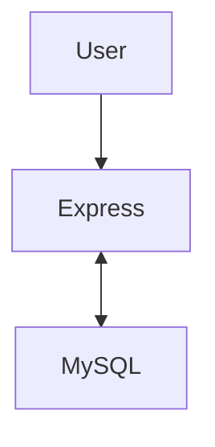

실시간으로 데이터가 쌓여감에 따라 데이터베이스 성능은 저하되고 예상치 못한 문제들이 발생한다.

**✓ 예상 문제점**
- [ ] 점점 느려지는 Query
- [ ] `Connection Limit` 설정에 따른 문제
- [ ] 데이터 삭제 등 스케줄링 필요
- [ ] 조회가 안되거나 하는 문제

이에 따라 데이터베이스 복제(Replication), 테이블 파티셔닝 등의 기법으로 대용량 데이터를 처리한다. 하지만 해당 문제점이 발생하는 환경은 경험 즉, 어느정도 데이터가 적재되어 있고, 트래픽이 얼마나 발생하는지 알 수가 없어서 부하 테스트를 해보기로 했다.


# 👷 테스트 환경

로컬에서 다음과 같이 데이터베이스 및 서버를 구축하였다.
- 웹 서버(Express)
- MySQL(2Core 2GB Memory)



## MySQL 테이블 정보
테스트 테이블 스키마는 다음과 같다.

**✓ Users 테이블**
- 사용자 정보를 저장 및 관리하는 테이블
- 테이블 명: `users`

| No | Column name | Data Type | NN | KY | Default | Description |
| ------ | ------ | ------- | -------------- | --- | --- | --- |
| 1 | user_id | `Integer` | ✓ | `PK` | | 기본 키 |
| 2 | email | `String` | ✓ | `PK` | | 이메일 |
| 3 | password | `String` | ✓ | | | 비밀번호 |
| 4 | username | `String` | ✓ | | | 사용자 이름 |
| 5 | nickname | `String` | ✓ | `Unique` | | 닉네임 |
| 6 | age | `String` | ✓ | | | 생년월일(YYMMDD) |
| 7 | created_at | `Date` | ✓ | | NOW | 생성일 |
| 8 | updated_at | `Date` | ✓ | | NOW | 변경일 |


### 웹 서버(Express)
`Express`로 사용자 생성과 조회만 구현한다.

**✓ Server**
- Node.js Express application
- 3000 Port

**✓ Endpoints**
- `POST /user` : 사용자 생성
- `GET /user/:id` : 특정 사용자 조회
- `GET /user/latest` : 최신 사용자 조회


## 테스팅 도구
처음 부하 테스트를 위해 ab를 사용했지만, 특정 환경에서 복잡한 상황을 연출할 수는 없었다.
아파차 벤치의 경우 요청 수와 호출 수를 지정하고 평균 응답 속도를 알려준다. 하지만, 특정 시간동안 점차적으로 트래픽을 증가하거나, 여러 URL을 동시에 요청하는 등에 기능은 제공하지 않았다.

```shell
# 10번의 동시 호출 수로 100개의 요청을 보냄
ab -n 100 -c 10 http://localhost:3000/user/latest
```


# 🛠️ K6
여러가지 테스트 도구가 있었지만 자바스크립트를 이용하여 비교적 간단하게 부하 테스트 환경을 구현할 수 있는 K6를 사용했다. Mac 환경에서는 `brew`로 간단하게 설치할 수 있다.

```shell
brew install k6
```
참고로 Docker 등 여러가지 방법으로 설치할 수 있다.


## 환경 구성하기

 **✓ 테스트 상황**
- 특정 시간 동안 진행
- 데이터가 어느정도 적재되어 있음
- 100명 이상의 사용자가 요청
- 사용자 생성 및 조회 쿼리가 동시 다발적으로 실행

### 테스트 환경설정
테스트 상황에 따라 다음과 같이 설정해주었다.

```typescript
import { check } from 'k6';
import http from 'k6/http';

export const options = {
	scenarios: {
		constant_request_rate: {
			executor: 'constant-arrival-rate',
			rate: 1000,
			timeUnit: '1s',
			duration: '1m',
			preAllocatedVUs: 200,
			maxVUs: 400,
		},
	},
};

const BASE_URL = 'http://localhost:3000';

const getUrl = (path) => `${BASE_URL}${path}`;
const randomId = (min = 4700, max = 5000) => Math.floor(Math.random() * (max - min + 1) + min);

export default function () {
	const [r1, r2, r3] = http.batch([
		['GET', getUrl(`/user/${randomId()}`)],
		['GET', getUrl('/user/latest')],
		['POST', getUrl('/user')],
	]);

	check(r1, {
		'is status 200': (r) => r.status === 200,
		'is status 404': (r) => r.status === 404,
		'is status 500': (r) => r.status === 500,
		'is duration < 200ms': (r) => r.timings.duration < 200,
	});
	
	check(r2, {
		'is status 200': (r) => r.status === 200,
		'is status 404': (r) => r.status === 404,
		'is status 500': (r) => r.status === 500,
		'is duration < 200ms': (r) => r.timings.duration < 200,
	});
	
	check(r3, {
		'is status 201': (r) => r.status === 201,
		'is duration < 200ms': (r) => r.timings.duration < 200,
	});
}
```

`options` 변수에 테스트 상황에 부합한 설정을 해준다.

**✓ Scenarios: Constant request rate**

| Property | Value | Description |
| --- | --- | --- |
| executor | `constant-arrival-rate` | 일정한 속도로 반복하여 요청을 진행 |
| rate | `1000` | 1000번 요청 |
| timeUnit | `1s` | 1000번의 요청이 1초 동안 진행 |
| duration | `1m` | 총 시나리오가 실행될 시간 |
| preAllocatedVUs | `200` | 시작전 할당된 VU 수|
| maxVUs | `400` | 실행 중 허용된 최대 VU 수 |

> ***VU(Virtual User) 란?**
> 애플리케이션에 동시에 액세스하고 실행하는 가상 사용자*

해석하면, 200~400명의 사용자가 일정한 속도를 가지고 1초에 1000번 반복하여 요청이 1분동안 진행된다.
요청은 다음과 같다.
- `r1` : 특정 사용자 조회
- `r2` : 가장 최근 저장된 사용자 조회
- `r3` : 사용자 생성


### 체크 리스트 및 결과

각각의 요청에 따라 상태코드로 에러 발생 여부를 확인한다.
- `is status 200` : 사용자 조회에 성공
- `is status 201` : 사용자 생성에 성공
- `is status 404` : 존재하지 않는 사용자
- `is status 500` : 알 수 없는 에러
- `is duration < 200ms` : 요청 성공에 걸리는 시간이 200 밀리초 이하

대략 6만 건이 적재된 `users` 테이블의 테스트 결과는 다음과 같다.

```shell

          /\      |‾‾| /‾‾/   /‾‾/   
     /\  /  \     |  |/  /   /  /    
    /  \/    \    |     (   /   ‾‾\  
   /          \   |  |\  \ |  (‾)  | 
  / __________ \  |__| \__\ \_____/ .io

  execution: local
     script: k6/query-benchmark.ts
     output: -

  scenarios: (100.00%) 1 scenario, 400 max VUs, 1m30s max duration (incl. graceful stop):
           * constant_request_rate: 1000.00 iterations/s for 1m0s (maxVUs: 200-400, gracefulStop: 30s)

WARN[0001] Insufficient VUs, reached 400 active VUs and cannot initialize more  executor=constant-arrival-rate scenario=constant_request_rate
WARN[0060] Request Failed                                error="Post \"http://localhost:3000/user\": request timeout"
WARN[0060] Request Failed                                error="Post \"http://localhost:3000/user\": request timeout"
WARN[0060] Request Failed                                error="Post \"http://localhost:3000/user\": request timeout"
WARN[0060] Request Failed                                error="Post \"http://localhost:3000/user\": request timeout"
WARN[0060] Request Failed                                error="Post \"http://localhost:3000/user\": request timeout"
WARN[0060] Request Failed                                error="Post \"http://localhost:3000/user\": request timeout"
WARN[0060] Request Failed                                error="Post \"http://localhost:3000/user\": request timeout"
WARN[0060] Request Failed                                error="Post \"http://localhost:3000/user\": request timeout"
WARN[0060] Request Failed                                error="Post \"http://localhost:3000/user\": request timeout"
WARN[0060] Request Failed                                error="Post \"http://localhost:3000/user\": request timeout"
WARN[0060] Request Failed                                error="Post \"http://localhost:3000/user\": request timeout"
WARN[0060] Request Failed                                error="Post \"http://localhost:3000/user\": request timeout"
WARN[0060] Request Failed                                error="Post \"http://localhost:3000/user\": request timeout"
WARN[0060] Request Failed                                error="Post \"http://localhost:3000/user\": request timeout"
WARN[0060] Request Failed                                error="Post \"http://localhost:3000/user\": request timeout"
WARN[0061] Request Failed                                error="Post \"http://localhost:3000/user\": request timeout"
WARN[0061] Request Failed                                error="Post \"http://localhost:3000/user\": request timeout"
WARN[0061] Request Failed                                error="Post \"http://localhost:3000/user\": request timeout"
WARN[0061] Request Failed                                error="Post \"http://localhost:3000/user\": request timeout"
WARN[0061] Request Failed                                error="Post \"http://localhost:3000/user\": request timeout"
WARN[0062] Request Failed                                error="Post \"http://localhost:3000/user\": request timeout"
WARN[0063] Request Failed                                error="Post \"http://localhost:3000/user\": request timeout"
WARN[0063] Request Failed                                error="Post \"http://localhost:3000/user\": request timeout"
WARN[0065] Request Failed                                error="Post \"http://localhost:3000/user\": request timeout"
WARN[0069] Request Failed                                error="Post \"http://localhost:3000/user\": request timeout"
WARN[0071] Request Failed                                error="Post \"http://localhost:3000/user\": request timeout"
WARN[0074] Request Failed                                error="Post \"http://localhost:3000/user\": request timeout"
WARN[0079] Request Failed                                error="Post \"http://localhost:3000/user\": request timeout"
WARN[0083] Request Failed                                error="Post \"http://localhost:3000/user\": request timeout"
WARN[0083] Request Failed                                error="Post \"http://localhost:3000/user\": request timeout"
WARN[0084] Request Failed                                error="Post \"http://localhost:3000/user\": request timeout"
WARN[0085] Request Failed                                error="Post \"http://localhost:3000/user\": request timeout"
WARN[0085] Request Failed                                error="Post \"http://localhost:3000/user\": request timeout"
WARN[0087] Request Failed                                error="Post \"http://localhost:3000/user\": request timeout"
WARN[0088] Request Failed                                error="Post \"http://localhost:3000/user\": request timeout"
WARN[0089] Request Failed                                error="Post \"http://localhost:3000/user\": request timeout"
WARN[0090] Request Failed                                error="Post \"http://localhost:3000/user\": request timeout"

     ✗ is status 200
      ↳  99% — ✓ 2123 / ✗ 19
     ✗ is status 404
      ↳  0% — ✓ 19 / ✗ 2123
     ✗ is status 500
      ↳  0% — ✓ 0 / ✗ 3213
     ✗ is duration < 200ms
      ↳  0% — ✓ 0 / ✗ 3213
     ✗ is status 201
      ↳  96% — ✓ 1034 / ✗ 37

     checks.........................: 26.95% ✓ 3176       ✗ 8605 
     data_received..................: 1.4 MB 16 kB/s
     data_sent......................: 314 kB 3.5 kB/s
     dropped_iterations.............: 58894  654.277521/s
     http_req_blocked...............: avg=163.82µs min=0s       med=7µs    max=8.69ms p(90)=250µs  p(95)=301µs 
     http_req_connecting............: avg=117.37µs min=0s       med=0s     max=4.69ms p(90)=209µs  p(95)=249µs 
     http_req_duration..............: avg=26.1s    min=221.87ms med=31.01s max=1m0s   p(90)=31.9s  p(95)=32.13s
       { expected_response:true }...: avg=25.7s    min=221.87ms med=31s    max=32.39s p(90)=31.86s p(95)=32.06s
     http_req_failed................: 1.72%  ✓ 56         ✗ 3185 
     http_req_receiving.............: avg=70.43µs  min=0s       med=66µs   max=1.23ms p(90)=89µs   p(95)=116µs 
     http_req_sending...............: avg=53.23µs  min=3µs      med=15µs   max=3.55ms p(90)=33µs   p(95)=52µs  
     http_req_tls_handshaking.......: avg=0s       min=0s       med=0s     max=0s     p(90)=0s     p(95)=0s    
     http_req_waiting...............: avg=26.1s    min=218.59ms med=31.01s max=1m0s   p(90)=31.9s  p(95)=32.13s
     http_reqs......................: 3241   36.005594/s
     iteration_duration.............: avg=26.96s   min=467.3ms  med=31.08s max=1m0s   p(90)=32.01s p(95)=32.25s
     iterations.....................: 1071   11.898177/s
     vus............................: 37     min=37       max=400
     vus_max........................: 400    min=400      max=400


running (1m30.0s), 000/400 VUs, 1071 complete and 36 interrupted iterations
constant_request_rate ✓ [======================================] 036/400 VUs  1m0s  1000.00 iters/s
```

### 결과 분석
생각보다 많은 실패와 대부분 성능 이슈가 발생했다는 점에서 충격이었다.

**✓ 종합 결과**
- Check 26% 통과
- 74% Check 실패
- 평균 26초 동안 요청이 지속 됨
- 최대 요청 지속 시간은 1분

**✓ 통과 결과**
- 99% 조회 성공
- 1%(19건) 사용자를 찾지 못함
- 알 수 없는 에러 없음
- 96% 리소스 생성 성공
- 4%(37건) 리소스 생성 실패
- 대부분 Request Timeout으로 리소스 생성에 실패 함

예상 문제점 대부분이 적중, 하지만 6만 건 이상에 데이터가 적재된 상황에서는 조회 쿼리가 안되거나 하는 문제는 발생하지 않았다.

**✓ 예상 문제점 확인하기**
- [x] 점점 느려지는 Query
- [x] `Connection Limit` 설정에 따른 문제
- [x] 데이터 삭제 등 스케줄링 필요
- [ ] 조회가 안되거나 하는 문제


## 프로젝트에 맞춘 테스팅 진행
좀 더 현실적인 방향으로 테스트를 구성해보자.
현재 진행할 프로젝트의 데이터베이스 과부하를 테스트할 예정이다. 하루에 평균 2,800건 정도의 데이터가 적재되고, 한 달 정도 지난 시점에서의 과부하가 발생한다는 시점이다.

### 테스트 환경설정
해당 시나리오는 100~200명의 사용자가 1분동안 100개의 요청을 일정한 속도로 요청한다.
```TypeScript
// 분당 100개의 요청을 1분간 보낸다.
export const options = {
	scenarios: {
		constant_request_rate: {
			executor: 'constant-arrival-rate',
			rate: 100,
			timeUnit: '1m',
			duration: '1m',
			preAllocatedVUs: 100,
			maxVUs: 200,
		},
	},
};
```


### 테스트 결과
역시 대부분 성능 이슈 때문에 실패하였다. 결과는 Checks 39% 통과하였지만 나머지는 실패하였다.

```shell

          /\      |‾‾| /‾‾/   /‾‾/   
     /\  /  \     |  |/  /   /  /    
    /  \/    \    |     (   /   ‾‾\  
   /          \   |  |\  \ |  (‾)  | 
  / __________ \  |__| \__\ \_____/ .io

  execution: local
     script: k6/query-benchmark.ts
     output: -

  scenarios: (100.00%) 1 scenario, 200 max VUs, 1m30s max duration (incl. graceful stop):
           * constant_request_rate: 1.67 iterations/s for 1m0s (maxVUs: 100-200, gracefulStop: 30s)


     ✓ is status 200
     ✗ is status 404
      ↳  0% — ✓ 0 / ✗ 200
     ✗ is status 500
      ↳  0% — ✓ 0 / ✗ 300
     ✗ is duration < 200ms
      ↳  45% — ✓ 136 / ✗ 164
     ✓ is status 201

     checks.........................: 39.63% ✓ 436      ✗ 664  
     data_received..................: 136 kB 1.5 kB/s
     data_sent......................: 29 kB  319 B/s
     http_req_blocked...............: avg=395.25µs min=133µs    med=334µs    max=4.4ms    p(90)=432µs    p(95)=453.79µs
     http_req_connecting............: avg=295.57µs min=101µs    med=287.5µs  max=1.08ms   p(90)=374.9µs  p(95)=400.85µs
     http_req_duration..............: avg=209.27ms min=174.83ms med=203.84ms max=328.48ms p(90)=249.92ms p(95)=271.18ms
       { expected_response:true }...: avg=209.27ms min=174.83ms med=203.84ms max=328.48ms p(90)=249.92ms p(95)=271.18ms
     http_req_failed................: 0.00%  ✓ 0        ✗ 302  
     http_req_receiving.............: avg=98.8µs   min=20µs     med=67µs     max=4.94ms   p(90)=90.8µs   p(95)=128µs   
     http_req_sending...............: avg=48.95µs  min=9µs      med=31µs     max=1.67ms   p(90)=48.9µs   p(95)=73.84µs 
     http_req_tls_handshaking.......: avg=0s       min=0s       med=0s       max=0s       p(90)=0s       p(95)=0s      
     http_req_waiting...............: avg=209.12ms min=174.71ms med=203.74ms max=328.37ms p(90)=249.82ms p(95)=271.09ms
     http_reqs......................: 302    3.355269/s
     iteration_duration.............: avg=229.71ms min=202.8ms  med=221.59ms max=329.25ms p(90)=266.74ms p(95)=286.94ms
     iterations.....................: 100    1.111016/s
     vus............................: 1      min=0      max=2  
     vus_max........................: 100    min=100    max=100


running (1m30.0s), 000/100 VUs, 100 complete and 1 interrupted iterations
constant_request_rate ✓ [======================================] 001/100 VUs  1m0s  1.67 iters/s
```
